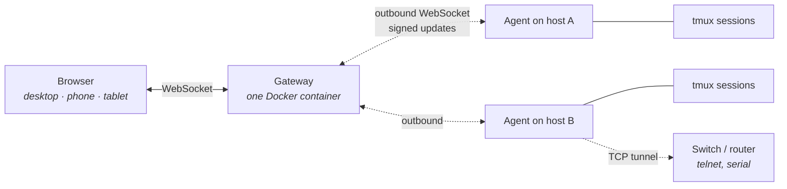
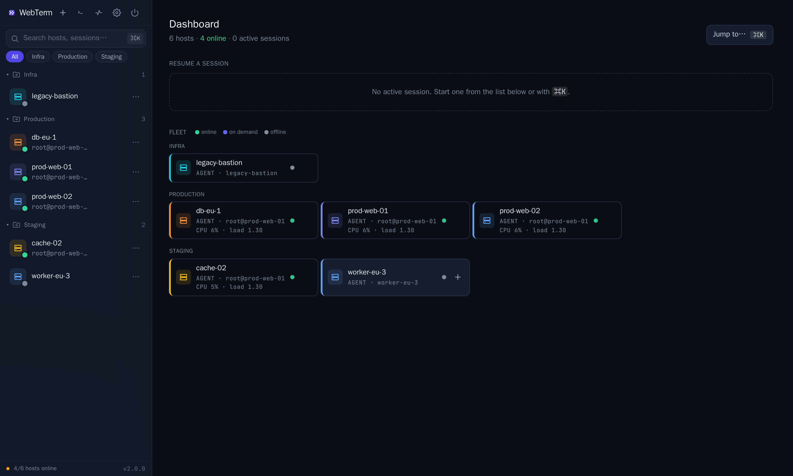
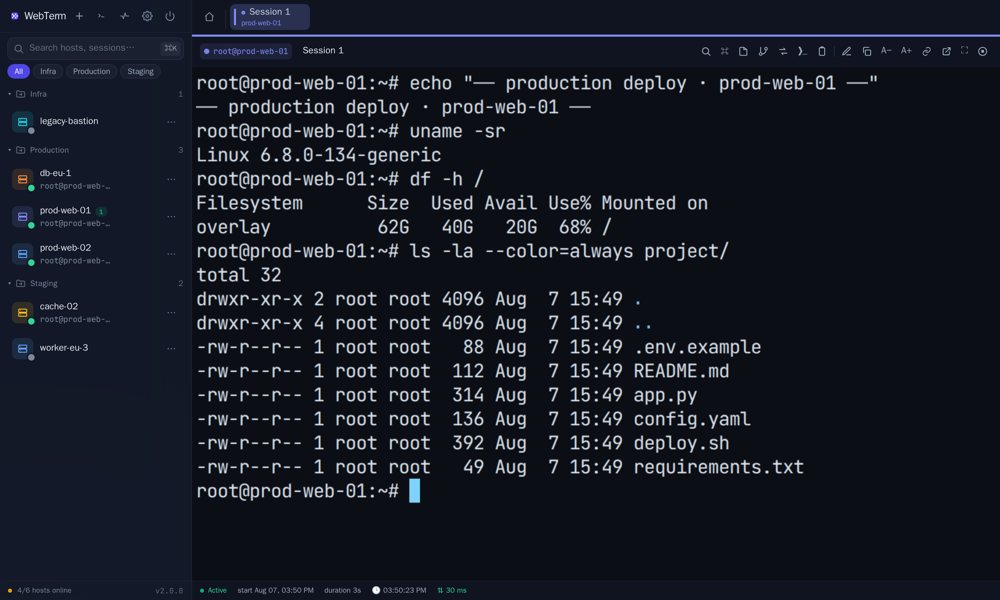
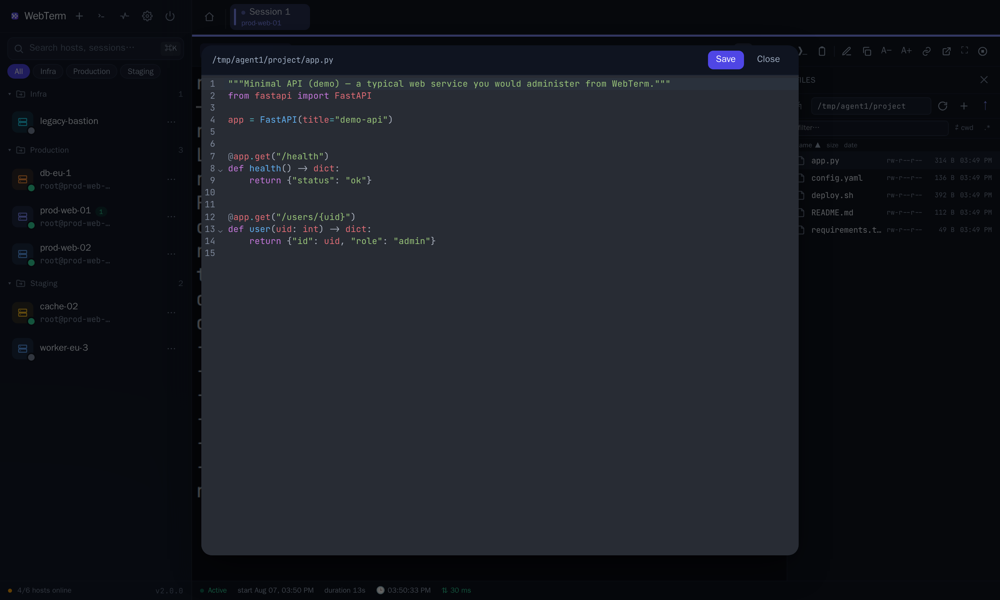
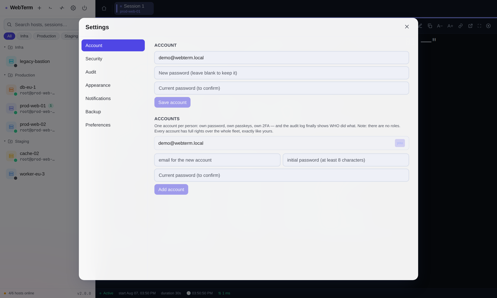

# WebTerm

[](https://github.com/sm26449/webterm/actions/workflows/docker-publish.yml)
[](LICENSE)
[](https://github.com/sm26449/webterm/tags)

**Persistent terminals for your servers, in the browser.**

Open a shell on any of your machines from a browser — including a phone — and come back to it
hours later with the process still running and the scrollback intact. Close the tab, restart the
gateway, reboot your laptop: the session is on the host, in tmux, and it waits.

Nothing listens on your servers. A small agent dials **out** to the gateway, so a machine behind
NAT or on a mobile connection works exactly like one with a public IP.



> [!WARNING]
> **Read this before exposing it to a network.** **Anyone who gets past the login gets, on every
> host, exactly the access of the user its agent runs as** — the same as handing over an SSH key
> for that user. It is built for a **single trusted administrator**: there are no roles, and the
> **gateway is a single point of total compromise**.
>
> The agent never escalates: it runs as whoever installed it. The install command offered by
> default creates a dedicated unprivileged `webterm` user and runs as that, so the answer above is
> "webterm's access", not root. Choose the *current user* tab while you are root and it becomes a
> root shell on that host — the installer says so before it proceeds.
>
> So: use a **domain with HTTPS and passkeys**, not an IP with a password, and keep the default
> dedicated user unless you need more. What it defends against and what it does not:
> **[docs/THREAT-MODEL.md](docs/THREAT-MODEL.md)**. Reporting a vulnerability:
> **[SECURITY.md](SECURITY.md)**.

## What it is for

You administer a handful of machines and you are tired of losing a long-running job because your
SSH client dropped, or of not being able to check on something from your phone.

WebTerm gives every host a list of named sessions with notes and the full history of what came
back (what you type is never recorded). It records each session to disk so you can replay it, search across all of them,
browse and edit files, expose a service from a host on its own subdomain, and reach a switch on a
host's private network without hopping through a shell first.

It is built for **one trusted administrator**. There are no roles, and that is a deliberate
decision explained below.

## Screenshots

> Fictional data (a demo fleet, not real hosts). Generated reproducibly with
> [`scripts/screenshots/run.sh`](scripts/screenshots/run.sh). Dark theme below; a
> light theme also exists (light chrome, the workspace stays dark like a real
> terminal).

**Fleet dashboard** — hosts, online status, metrics, folders.



**Live terminal** — persistent tmux sessions, reattachable from any device.



**Files + editor** — browse, edit (CodeMirror) and transfer files on the host.



**Security** — the fleet signing key, passkeys, 2FA (here on the light theme).



## Why

Xterm with lots of tabs: unsafe copy/paste, clunky history, tabs that close and
lose the session. WebTerm fixes that — a single app, sessions in the sidebar,
that never get lost.

- **The agent calls home** (outbound WSS + token) — you open no ports on servers,
  it works through NAT; the gateway keeps no SSH passwords/keys.
- **Sessions live in tmux** on a dedicated socket: they survive an agent crash or
  upgrade; they are re-adopted by name on restart.
- **Reliability**: everything is capped (2 MiB ring buffer/session, max 32
  sessions/host, ack-based flow control at 256 KiB, rotated logs); ~0 CPU idle;
  the agent restarts itself on kill/reboot (systemd or a cron watchdog).
- **Hardened for the internet** — see [Security](#security).

## Features

**Sessions**
- Sessions as conversations: title, note, full history of everything the host
  printed, search (what you type is never recorded — see Security)
- Multiple devices at once on the same session (desktop + phone, live)
- **Instant tabs**: recent sessions stay mounted (terminal + buffer), and
  switching is just a visibility change. The stream flows **only** on visible
  panes; background tabs are paused at the gateway and re-sync on return if they
  missed anything
- Split view, popout into its own window, layout restored on reload
- **History replay**: closed sessions can be replayed in the UI (play/pause,
  seek, 1×/2×/4×), not just downloaded (`.cast`)
- **History as text**: a **Text** tab next to the player renders the transcript with
  control sequences stripped — searchable, and downloadable as `.txt`. Replay is faithful
  but useless when a full-screen app ran inside (it repaints the same screen instead of
  scrolling); text is how that history becomes readable

**Session sharing**
- **Share link** for a session: **read-only** or **writable** (the guest can
  type), with **expiry** and **instant revocation**. The guest window mirrors the
  owner's PTY grid (size + its own zoom); on revoke, the broadcast stops and the
  terminal is wiped with a dedicated "403" page
- **Roster** of viewers (how many / who) and **kick** from the session; optional
  watermark over the share

**Commands as objects (OSC 133)** — [details](docs/SHELL-INTEGRATION.md)
- With shell integration enabled, every command has identity — exit code,
  duration, its own output. A side panel lists all commands, `Alt+↑/↓` jumps
  between them, green/red gutter decorations
- **Per-command actions**: "Run again" (drops it at the prompt — you run it with
  Enter, nothing re-runs blindly), copy the command / the output / as markdown
  (command + output + exit code, ready to paste into a ticket)
- We re-render nothing → **TUIs stay intact** (vim, htop, Claude Code)

**Keyboard-first** — press `?` for the cheatsheet
- Command palette (⌘K): sessions, hosts, actions, snippets
- Shortcuts for scrollback search, close/reopen/navigate tabs, split, popout,
  font, snippets — [full map](docs/SHORTCUTS.md)
- **Parametrized snippets** (`{{param}}`): a form at run time, with a preview of
  the final command before execution

**Fleet**
- Per-host metrics (CPU, RAM, disk, load) with a **trend sparkline**
- **Threshold alerts** (CPU/RAM/disk) over email, with hysteresis and throttling
- **In-session file manager** (toolbar button): a side panel that **follows the
  terminal's `cd`** (OSC 7), dense listing with sort/filter/keyboard navigation,
  mkdir/rename/delete, drag&drop upload (including **folders**) with progress +
  cancel, a **CodeMirror** editor with highlighting, large files opened view-only
  (partial-read), atomic save with conflict detection
- **Git panel** (toolbar button): for the repo in the session's current directory
  (follows `cd` via OSC 7) — status, **colored diff**, stage/unstage and
  **commit**, without opening GitHub. Focused scope: merge/rebase/push/branch stay
  in the CLI
- **Port forwarding** (toolbar button): expose web services from the host through
  the browser, protected by your own auth — Docker containers, monitoring, admin
  panels bound to localhost. Reverse-proxy **HTTP + HTTPS + WebSocket** (no
  `ssh -L`, works from an iPad too); on **agent** hosts through the WSS tunnel, on
  **SSH** hosts through a direct-tcpip channel. Each forward on an isolated
  subdomain (`<slug>.<domain>`, domain configurable in Settings), `__Host-`
  cookie, slug-bound HMAC token, anti-SSRF. The connection opens only on real
  traffic. [details](docs/PORT-FORWARDING.md)
- **Telnet bastion** (`telnet` scheme on a forward): the CLI of a device on the
  host's LAN (switch/router) inside a **terminal tab**, tunneled through the agent
  — the host becomes a jump host. Custom IAC shim; password redacted from the
  transcript, OSC 133/52 filtered from the untrusted device; **↻ 1-click
  reconnect** if the agent drops. [details](docs/design/TELNET-BASTION.md)
- **Serial console** (RS232/RS485/USB): a serial device attached to the host,
  inside a **terminal tab** through the agent — with port **discovery** (rich
  metadata: VID:PID, USB serial, driver, physical path, UART type) and **physical
  identification** (unplug/replug the adapter). [details](docs/SERIAL-CONSOLE.md)
- **Run across multiple hosts** (fleet console): one command → N hosts → a grid of
  live results (state, exit code, output per host), with a deliberate confirmation
  first. "Copy report" as markdown. [details](docs/FLEET.md)
- **Global command history**: search across every command run — on all hosts and
  sessions, from the command palette. Also a light audit log
- **Agent diagnostics** (host menu, available even offline): live state, last
  heartbeat, version, **agent↔gateway RTT**, uptime/reconnects, an **event
  timeline** (connect/disconnect + reason) and the **agent log** — debugging
  without SSH
- Time zone synced across sessions; the server clock in the status bar

**Data & backup** — [details](docs/RUNBOOK.md)
- **Backup/restore from Settings**, no server access needed: download a
  crash-consistent DB snapshot (`VACUUM INTO`) + the vault key, **encrypted with a
  password you choose** (scrypt → AES-256-GCM). Automatic daily/weekly backup
  (kept 7 days, in-UI notification). Validated restore (password + `integrity_check`)
  with a pre-restore snapshot as a safety net

**Appearance & accessibility**
- UI themes: Aurora (light), Midnight (dark), Auto (follows the system); PWA on mobile
- **Custom terminal themes**: scheme editor with live preview, **iTerm2/VS Code
  import**, per-host scheme ("production is reddish")
- **Watermark** optional (Settings → Appearance): a tiled overlay (email/host/time)
  over the workspace **and** over shared sessions (applied server-side) — deters
  leaks / gives traceability
- Guaranteed minimum contrast (WCAG AA) in the terminal, screen-reader mode
  (opt-in), `Ctrl+M` to Tab out of the terminal
- Desktop-grade copy/paste: Ctrl/Cmd+C on a selection copies (no selection = ^C),
  copy-on-select, right-click context menu, focus events (vim `autoread`)

## Quick install

Prerequisites: Docker + Docker Compose, a domain (recommended) or an IP, and `make`
if you want the shortcuts below (`make token`, `make upgrade` — everything they wrap
can also be run by hand).

**Architecture.** The published image is `linux/amd64`. On anything else — a Raspberry Pi,
an ARM VPS, an Apple Silicon machine running Docker natively — use `setup.sh`, which builds
from source locally (about half a minute) and never touches the registry; the base images are
multi-arch and nothing in the build is architecture-specific. `install.sh` is the path that
pulls the prebuilt image, so that one wants amd64. The agent is a single stdlib Python file
and runs on any architecture either way.

Ports **80** and **443** must be free: `docker-compose.yml` binds them for TLS. If
something else already holds them, add a `docker-compose.override.yml`. Note the
`!override` tag: compose **concatenates** port lists, so without it 80 and 443 stay
published and the container still fails to start.

```yaml
services:
  caddy:
    ports: !override
      - "8080:80"
      - "8443:443"
```

Then pass the port to `setup.sh` as part of the host — `./setup.sh 192.168.1.10:8443`.
It keeps the port in `WEBTERM_PUBLIC_URL` (the agent install command shown in the UI is
generated from that URL, so it is wrong without it) and strips it from `WEBTERM_DOMAIN`,
which becomes Caddy's site address and must not carry one.

```sh
git clone https://github.com/sm26449/webterm && cd webterm
./setup.sh term.example.com          # or ./setup.sh 192.168.1.10 to test on an IP
```

The script checks Docker, writes `.env`, builds the image, starts everything
(Caddy does TLS automatically for a domain) and prints the **setup token** for
the first account. Open the URL, enter the token + email + password, then add a
passkey from **⚙ Settings**.

Without the interactive script: copy `.env.example` → `.env`, fill it in, and
`docker compose up -d --build`. The setup token:

```sh
make token          # or, without make:
docker compose logs app | grep -oE 'WEBTERM_SETUP_TOKEN=[A-Za-z0-9_-]+' | tail -1 | cut -d= -f2-
```

## Deploy from an image (production, no build)

Every push to `main` publishes an image to the GitHub Container Registry
(`ghcr.io/sm26449/webterm`). On the server you build nothing: pull the image
and start, with **Traefik** issuing the Let's Encrypt certificate via **DNS-01
Cloudflare** (works behind the Cloudflare proxy, through NAT, with no port 80
exposed; supports wildcard).

**Two tokens** for the common case: Cloudflare (DNS) and the app setup token
(auto-generated). Pulling the public image needs no authentication; a GitHub
`read:packages` token is only needed if you **fork and keep your own image
private**.

> **Not on Cloudflare?** This image deploy issues the certificate via DNS-01
> Cloudflare. If your DNS isn't on Cloudflare, use the [Quick install](#quick-install)
> path instead — Caddy gets a Let's Encrypt certificate via HTTP-01, no Cloudflare
> needed (just point a public DNS record at the server and keep ports 80/443 reachable).

### Clean server? One command: `install.sh`

On a freshly installed Ubuntu/Debian, the installer does the whole chain: Docker
(official repo), runtime files in `/opt/webterm`, `.env` (chmod 600), firewall
(ufw: OpenSSH + 80/443), the Traefik + app stack, daily backup (systemd timer,
03:30, keeps 14 archives) and a health check. Idempotent — running it again keeps
`.env` and the data.

```sh
# interactive (asks for domain and email; the Cloudflare token is optional):
git clone https://github.com/sm26449/webterm && cd webterm
sudo ./install.sh

# or non-interactive (cloud-init, Ansible, etc.):
sudo ./install.sh --non-interactive \
  --domain term.example.com --email you@example.com \
  --ghcr-token <github-token>
```

**TLS needs no Cloudflare account.** With no token, Let's Encrypt is obtained over
**HTTP-01**: all it needs is that `term.example.com` resolves to this server and that
port 80 is reachable from the internet. Add `--cf-token` only if you are behind the
Cloudflare proxy or behind NAT without port 80 — or if you use **port forwarding**:
those live on subdomains matched by a pattern, so Traefik cannot
derive their names and only a wildcard covers them — and only DNS-01 can issue a wildcard.
On HTTP-01 the application itself gets TLS normally; forwards do not.

`sudo ./install.sh --help` lists all options (`--dir`, `--image`, `--no-ufw`,
`--no-backup`…). At the end you get the URL and the setup token.

### Already have Docker? `deploy.sh`

```sh
# on the server, with Docker installed
git clone https://github.com/sm26449/webterm && cd webterm
cp .env.prod.example .env
#   WEBTERM_DOMAIN      = term.example.com
#   LETSENCRYPT_EMAIL   = you@example.com
#   CF_DNS_API_TOKEN    = (optional) Cloudflare token, Zone:DNS:Edit — leave empty for HTTP-01
#   GHCR_TOKEN_FILE     = (optional) GitHub token, read:packages — only for a private/forked image
./deploy.sh            # or: make deploy
```

`deploy.sh` generates the setup token if missing, authenticates to ghcr.io, pulls
the image and starts the stack (Traefik + docker-socket-proxy + app). It reuses
the data volume, so moving from a previous Caddy stack keeps SQLite + the
transcripts. Open `https://your-domain`, enter the setup token (`deploy.sh`
prints it), create the account + passkey.

Update with `./upgrade.sh` — it takes a backup, syncs the host-side scripts and hands off to
`deploy.sh`. (`make pull` exists for a quick image swap, but it bypasses `deploy.sh`, so it
records no rollback point and runs no health gate.) Deploy a specific version
with a recorded rollback point: `./deploy.sh v2.0.0` — if the new container does
not become healthy, the script rolls back automatically; any time afterwards,
`./rollback.sh` returns you to the previous image with a single command.

**Upgrading: one command.** `cd /opt/webterm && sudo ./upgrade.sh` takes the
latest published version; pass a tag to target one. It resolves the version, checks ghcr auth
and disk space, pulls the image, **takes a backup**, **syncs the files that run on the host**
(compose, the operator scripts — `backup.sh`, `restore.sh`, `rollback.sh`, `deploy.sh`,
`remove.sh`, `cert-check.sh` — and `upgrade.sh` itself; `/opt/webterm` is not a git checkout, so
otherwise they stay frozen at whatever the installer put there), then hands off to `deploy.sh`
for the pinned deploy with automatic rollback. The full
recovery procedure (including when the UI is completely unreachable):
[docs/RUNBOOK.md](docs/RUNBOOK.md).

**The three tokens, in short:**

| Token | Where | Scope | Role |
|---|---|---|---|
| Cloudflare | `CF_DNS_API_TOKEN` in `.env` | Zone : DNS : Edit (your zone) | the TLS certificate via DNS-01 |
| GitHub *(optional)* | file in `GHCR_TOKEN_FILE` | `read:packages` | only to pull a **private/forked** image |
| Setup | generated by `deploy.sh` in `.env` | — | the gate for creating the first account |

## Provisioning a server

In the UI: **+ host** → you get a `curl … | sh` command. Copy/paste → Enter on the
server, **as the user you want to work as** (the agent's user = the sessions'
shell). The script downloads the agent into `~/.webterm/`, starts it and sets up
automatic restart (systemd `--user` with Restart=always, otherwise cron `@reboot`
+ watchdog). It also **appends one line to `~/.bashrc` and `~/.zshrc`** so shell integration
(OSC 133) works — the commands panel, per-command exit codes and `cd` tracking depend on it.
Set `WEBTERM_NO_SHELL_INTEGRATION=1` before running the command to skip that; everything else
works without it. Requires python3 ≥ 3.6; **`tmux` is what makes sessions persistent** — without it
the agent runs on a plain PTY and sessions die with it.
On-server diagnostics: `python3 ~/.webterm/ptyd.py info`.

## Configuration

Everything in `.env` (see `.env.example`):

| Variable | Role |
|---|---|
| `WEBTERM_PUBLIC_URL` | public URL (browser, agents, WebAuthn), e.g. `https://term.example.com` |
| `WEBTERM_DOMAIN` | the domain for TLS (Caddy on a local build, Traefik on an image deploy) |
| `LETSENCRYPT_EMAIL` | email for the Let's Encrypt certificate (Traefik deploy) |
| `CF_DNS_API_TOKEN` | Cloudflare token (Zone:DNS:Edit), **optional**. Empty → Let's Encrypt over HTTP-01, no DNS provider needed (domain resolves here + port 80 reachable). Set it behind the CF proxy or NAT, and for a wildcard covering all forward subdomains |
| `WEBTERM_AGENT_INSECURE` | `1` only for IP access (self-signed). **Local build only** — `docker-compose.prod.yml` deliberately does not pass it, so an image deploy cannot turn off TLS verification toward the agent (`tests/compose_env_test.py` records the exception). It also leaves the **agent bootstrap unauthenticated**: the install one-liner fetches with `curl -k`, and certificate pinning only begins on the first connection — so whoever can intercept that single download installs their own agent, with their own update key, at the rights you run it as. Enrol over a network you trust, or issue a real certificate first. The UI says so next to the command |
| `WEBTERM_SETUP_TOKEN` | fixed for the first account; empty = generated + printed in the logs |
| `WEBTERM_CLIENT_BUFFER` | per-browser backlog before resync (default 1 MiB) |

## Persistence

**Persistence is tmux.** Without `tmux` on the host the agent falls back to a plain PTY
and says so (Host details → Backend: `pty`), but the fallback is silent in the sense that
matters: sessions still open and still work — they just do not survive an agent restart.
The table below describes the tmux backend.

| Event | Effect |
|---|---|
| Close the tab / browser | nothing — the gateway stays attached and keeps recording |
| Gateway restarts | the agent reconnects, exact reattach from the offset |
| Agent dies (`kill -9`) | tmux keeps the sessions; the new agent re-adopts them |
| Server reboots | sessions are marked "lost"; the conversation & history remain |

History: `<sid>.out` (raw stream, replayed on reconnect) + `<sid>.cast`
(asciicast v2 with timestamps, downloadable). Both hold **output only**: input is
never written to a transcript, so a password typed at an echo-off prompt cannot
leak into a recording or a backup of one. Closed sessions
stay in the sidebar until you delete them.

## Security

Hardened for public exposure: argon2 passwords + passkeys, single-use setup token
(anti-hijack on first start), brute-force lockout on the real IP (X-Forwarded-For),
constant-time login (no account enumeration), `__Host-` HttpOnly/Secure cookie,
Origin check on the WebSocket (anti-CSWSH), CSP + HSTS + anti-clickjacking,
path-traversal blocked. On **2FA** hosts, the terminal **locks on inactivity**
(output suppressed + input refused server-side) and resuming requires a **passkey
step-up** — protecting against unattended authenticated sessions
(`WEBTERM_IDLE_LOCK_SECS`, default 5 min). An optional **command guardrail**
(Settings → Security): regex rules that require **confirmation** or **block**
dangerous commands at Enter (e.g. `rm -rf`, `mkfs`) — editable, and enforced on the
server for `/run` as well, so a fleet command cannot walk around the browser.

**Security model:** whoever gets past login has access to the files and shell of
the agent's user (like SSH). That's why: run it with a **domain + passkeys** (not
just IP/password), install agents as a **dedicated, non-root user** where you can,
and complete setup immediately after deploy. `tests/security_test.py` covers the
protections.

**Off-host backup, from the UI (Settings → Backup).** Connect Google Drive or Dropbox with
one button (OAuth) and scheduled backups leave automatically into your account,
**encrypted with your passphrase** — the provider gets a file it cannot read; with no
passphrase configured we refuse to upload. Least privilege: `drive.file` (only files the
app itself creates) or a Dropbox *App folder* app. Separate remote retention. The ops
alternative is still `scripts/backup.sh` with `WEBTERM_BACKUP_REMOTE` (rclone).

**Accounts (Settings → Account).** You can create more than one account, so each person
signs in with their own password, passkeys and 2FA, and the audit log records *who*. There
are **no roles**: every account is a full administrator over the whole fleet — multiple
accounts buy attribution, not isolation.

**Automation tokens (Settings → Security).** For cron, CI or monitoring: a bearer token
with an explicit scope (`read` for status/hosts/sessions/audit, `run` for fleet commands),
mandatory expiry, hashed at rest, revocable in one click, and recorded in the audit log as
`token:<name>`. It is deliberately narrow — no accounts, no signing key, no backups, and
**hosts marked 2FA refuse tokens** because step-up needs a human with a passkey.

```sh
curl -H "Authorization: Bearer wt_…" https://your-domain/api/status
```

**Audit log (Settings → Audit).** Every request that changes something (POST/PATCH/DELETE
on `/api`) is recorded with actor, IP, path, status and a detail (which command, which
file, share writable or not), together with the reads that take data *out* — file
downloads, transcripts, previews. Request bodies are never stored — passwords and file
contents don't reach the log. `POST /api/history` is skipped (it has its own table), as
are rejected requests with no actor. Retention via `WEBTERM_AUDIT_DAYS` (default 120 days).
The browser session can be tightened with `WEBTERM_SESSION_TTL_DAYS` (default 30) and
`WEBTERM_SESSION_IDLE_HOURS` (default 12).

**Signed agent updates (Ed25519).** Agents only accept `ptyd.py` signed with the
key whose public half is pinned inside them (`UPDATE_PUBKEY`, TOFU at install); CI
refuses the build if `agent/ptyd.py` changed without re-signing. There are two ways
to own that key:

- **Per-deployment key (the default — you get one automatically)** — on the first boot
  of an install with no key and no enrolled hosts, the gateway generates its own key,
  substitutes `UPDATE_PUBKEY` in the `ptyd.py` it serves, and re-signs at runtime, so
  your fleet trusts only *your* key. It lives on the gateway (`data/agent-signing.key`)
  and is written **without a passphrase**, because auto-updates must survive a restart
  nobody is watching. **Settings → Security** shows its status; the *generate* and
  *import* buttons there apply to an install that does not have a key yet (they return
  409 once one exists), so choosing an encrypted key is a decision made at that moment,
  not later. Full model: [docs/design/SIGNED-UPDATES.md](docs/design/SIGNED-UPDATES.md).
- **Build-time key (fork & build your own image)** — a key that stays offline, used to
  sign at build/commit time, never on the gateway:

  ```sh
  scripts/gen-signing-key.py /secure/path/webterm-signing-key.pem
  git add agent/ptyd.py agent/ptyd.py.sig && git commit -m "own signing key"
  ```
  On every later `ptyd.py` change: `WEBTERM_AGENT_SIGNING_KEY=<key.pem> scripts/sign-agent.py`.

Either way, **keep an offline backup of the private key** — without it, deployed
agents accept no more updates. Honest trade-off: a gateway-resident per-deployment key
means a fully-compromised gateway (with the key *unlocked*) could sign a malicious
update — but the gateway is already the single point of total compromise (see the
[threat model](docs/THREAT-MODEL.md)), so this doesn't widen the blast radius.

## Commands (Makefile)

```sh
make help      # full list
make up        # build + start (dev)    make logs-app  # gateway logs
make down      # stop                   make token     # the setup token
make restart   # restart gateway        make backup    # data backup to ./backups
make update    # git pull + rebuild     make test      # the test suite
make deploy    # production (image)     make pull      # pull the latest image
#                                        (backup needs WEBTERM_BACKUP_PASSPHRASE)
```

## Development

```sh
python3 -m venv .venv && .venv/bin/pip install \
  -r gateway/requirements.txt -r gateway/requirements-dev.txt
cd frontend && npm ci && npm run build && cd ..

# backend with reload + frontend vite dev (proxy to :8000)
PYTHONPATH=gateway .venv/bin/uvicorn app.main:app --reload &
cd frontend && npm run dev
```

### Tests

One runner, used by both CI and you — `scripts/run-tests.sh`. The list of suites lives
there, in one place: when it was duplicated, `make test` silently ran 2 files while CI ran
22.

```sh
make test         # hermetic suite — EXACTLY what CI gates the image on
make test-local   # + the suites that need real tmux/agent on this machine
```

The `local` group starts a real agent. It is **sandboxed from any production agent** on the
same box (`tests/tmux_sandbox.py`): `$HOME` does not isolate tmux — the socket lives in
`$TMUX_TMPDIR/tmux-<uid>/`, keyed by UID — so tests get their own `TMUX_TMPDIR` and refuse
to run if the computed socket is the production one while an agent is alive. Without that,
a test run adopts and then kills the live sessions (it did, on 2026-08-05).

Suites needing a running stack (`instance_fence`, `storm`) or system users (`ssh`,
`provision`, which create/delete accounts via sudo) are listed by the runner but not run
automatically.

**E2E in a browser** (Playwright, real agent). CI runs `scripts/e2e-session.mjs`; to run it
locally without Node installed:

```sh
docker run -d --name smoke -p 8000:8000 -e WEBTERM_SETUP_TOKEN=ci-e2e-token \
  -e WEBTERM_PUBLIC_URL=http://127.0.0.1:8000 -e WEBTERM_AGENT_INSECURE=1 webterm-smoke:ci
# tmux inside the container: WITHOUT it the agent falls back to the `pty` backend and the
# E2E tests a different backend than production — that gap hid a whole class of bugs
docker exec -u root smoke sh -c 'apt-get update -qq && apt-get install -y -qq tmux'
docker exec smoke sh -c 'printf "%s" "{\"url\":\"ws://127.0.0.1:8000/agent/ws\",\"token\":\"$TOK\",\"insecure\":true}" > /root/.webterm/agent.json'
# the Playwright image ships the BROWSERS, not the npm package — install it first,
# or the script dies with ERR_MODULE_NOT_FOUND: Cannot find package 'playwright'
docker run --rm --network host -v "$PWD/scripts:/w" -w /w \
  -e AGENT_TOKEN_FILE=/w/token -e E2E_SETUP_TOKEN=ci-e2e-token \
  mcr.microsoft.com/playwright:v1.61.1-noble \
  sh -c 'npm i --no-save playwright@1.61.1 >/dev/null 2>&1 && node e2e-session.mjs http://127.0.0.1:8000 smoke'
```

`AGENT_TOKEN_FILE` makes the script write the enrol token to disk instead of shelling out to
`docker` (it has no Docker CLI inside the Playwright image); start the agent yourself with
that token, as above.

## Layout

```
agent/
  ptyd.py                  single-file agent (stdlib, Python 3.6+), Ed25519-signed
  shell-integration.sh     OSC 133 markers (bash/zsh), installed with the agent (opt out
                           with WEBTERM_NO_SHELL_INTEGRATION=1); appends one line to ~/.bashrc
gateway/app/
  main.py                  FastAPI, security headers, static, periodic reapers
  api.py                   REST + WS agent/browser + installer + idle-lock 2FA
  core.py                  session hubs, liveness reconciliation, file transfer,
                          telnet-via-agent, port forwarding
  telnet.py                IAC shim + OSC filter for the telnet bastion (untrusted device)
  security.py              passwords, sessions, rate-limit, brute-force, passkey step-up
  email_alerts.py          security alerts + resource thresholds (hysteresis)
  webauthn_api.py          passkeys
  backup.py                backup/restore from Settings (VACUUM INTO snapshot,
                          scrypt→AES-GCM encryption, restore at boot)
  db.py / config.py        SQLite + configuration
frontend/src/
  components/              SessionView, TabBar, CommandsPanel, ForwardsPanel,
                          FleetRunModal, HistoryModal, TranscriptPlayer…
  lib/                     shortcuts (single registry), commands (OSC 133),
                           termtheme (schemes + iTerm/VSCode import), metrics
scripts/
  e2e-session.mjs          E2E with a REAL agent (runs in CI)
  fs-test.sh · fwd-test.sh file operations · port forwarding (CI)
  mobile-audit.mjs         responsive audit on real devices (CI)
  smoke-boot.mjs           boot smoke test (UI starts with no JS errors)
  sign-agent.py            signs the agent at release (the key stays offline)
tests/                     unit + integration suite (dev): telnet (shim/bastion),
                          session reconciliation, agent hygiene+hardening, idle-lock,
                          security, ssh, transcript, provisioning…
docs/                      RUNBOOK · SHORTCUTS · SHELL-INTEGRATION ·
                          PORT-FORWARDING · FLEET · SERIAL-CONSOLE ·
                          THREAT-MODEL
  design/                  architecture notes: ARCHITECTURE · SIGNED-UPDATES ·
                          SESSION-LIFECYCLE · TELNET-BASTION ·
                          FUTURE-DIRECTIONS
deploy.sh · rollback.sh    production: pin, health gate, rollback
```

## Testing & release gates

A broken build must not be able to reach production — least of all on a tool you
administer your servers with. The CI chain, in order:

0. **Unit tests and hygiene** (`unit-tests`, which everything else depends on) —
   the Python + shell suite, `ruff`, a gitleaks scan, a check that the version badge
   matches the code, a `requirements.lock` drift check, and **`pip-audit --strict`**,
   which is blocking.
1. **Agent signature verification** — if `agent/ptyd.py` changed without
   re-signing, the build fails (agents would refuse the update anyway).
2. **Boot smoke test** (`scripts/smoke-boot.mjs`) — the image starts in an
   ephemeral container, a headless Chromium checks that the UI reaches a working
   screen, with no JS errors. Catches exactly the class of bug that produced the
   white screen in v1.0.11.
3. **E2E with a REAL agent** (`scripts/e2e-session.mjs`, 74 checks) — starts an
   agent in a container **with tmux installed, i.e. the backend production uses**,
   opens sessions through the UI, types commands, verifies the output, tab
   switching, pause/re-sync, shortcuts, parametrized snippets, alert thresholds,
   transcript replay, the OSC 133 flow + **block actions**, the file panel,
   **port forwarding**, **fleet run**, **command history**, and a **reconnect with
   history replay** (no duplicate entries, no prompts captured as commands, new
   commands still recorded). Running this on the `pty` fallback would test a
   different backend than production — that gap hid a whole class of bugs.
4. **FS API** (`scripts/fs-test.sh`, 24) — end-to-end file operations with a real agent.
5. **Port forwarding** (`scripts/fwd-test.sh`) — auth handshake, HTTP +
   WebSocket proxy + **https targets**, **configurable domain**, **SSH hosts**
   (real sshd), and security tests (slug-bound token, anti-SSRF, the 2FA gate,
   anti-CSWSH).
6. **Mobile audit** (`scripts/mobile-audit.mjs`) — 10 real devices (iPhone/iPad/
   Android, WebKit + Chromium); any layout regression blocks the image.
7. **Accessibility** (axe-core, `A11Y_MAX_SERIOUS=0`) — a single serious violation
   fails the build.

Only if all pass does the image publish to ghcr. On deploy, `deploy.sh` keeps the
previous image and does an **automatic rollback** if the new container doesn't
become healthy; `rollback.sh` is the panic button over SSH. Full recovery:
[docs/RUNBOOK.md](docs/RUNBOOK.md).

## Backup

Everything that matters is in the `webterm-data` volume (`/data`): `webterm.db`,
`transcripts/`, `secret`, and `agent-signing.key` — the last being the one artefact whose
loss is irreversible: without it the fleet can never be updated again.

What is **not** in the volume, and therefore not in the archive: the archive's own
passphrase (`/etc/default/webterm-backup`), `/opt/webterm/.env`, and the TLS certificates.
That matters only when you rebuild the machine — and then it matters a great deal, because
the passphrase lives on the machine you are about to wipe. The checklist and the full
rebuild procedure are in [docs/RUNBOOK.md](docs/RUNBOOK.md#what-the-archive-does-not-contain).

`make backup` writes to `./backups`. Set **`WEBTERM_BACKUP_PASSPHRASE`** (in
`/etc/default/webterm-backup` for the scheduled timer) and it writes an encrypted
`.tar.gz.enc`. Without it, an interactive run warns and writes plaintext, but a
**non-interactive run refuses and exits 1** — the archive would contain the vault key
in the clear. That is deliberate; it also means an unconfigured cron job produces
nothing at all. `WEBTERM_BACKUP_ALLOW_PLAINTEXT=1` overrides it, and is not advised.

**From the app (Settings → Backup)** — no server access needed:

- **Download a backup** any time: a crash-consistent DB snapshot (`VACUUM INTO`) +
  the vault key + optionally the transcripts. Because it includes the key (which
  decrypts all credentials), the download is **encrypted with a password you
  choose** (scrypt → AES-256-GCM) — **without the password you cannot restore,
  don't lose it**.
- **Automatic backup** daily/weekly, kept 7 days on the server. When it's ready
  you get an in-app notification and can download it (encrypted on download).
- **Restore** from a `.wtbk`: after validation (password + DB integrity), the app
  restarts and replaces the data; a pre-restore snapshot is saved automatically as
  a safety net.

Your job is to move the copies **off-site** — a backup left on the same server
does not protect you from losing the VPS. See [RUNBOOK](docs/RUNBOOK.md).

## License

[MIT](LICENSE) · see [CHANGELOG](CHANGELOG.md) for history.

## Acknowledgments

Built by Stefan Maldaianu, with development assistance from Claude (Anthropic).
