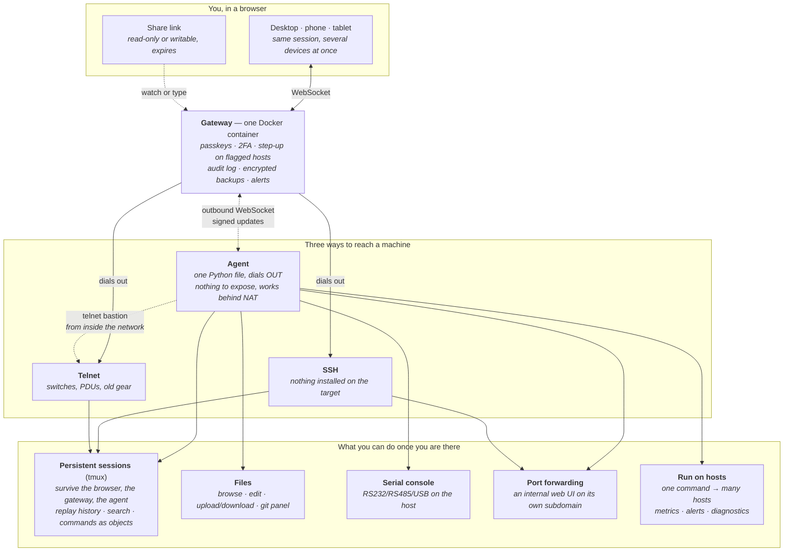
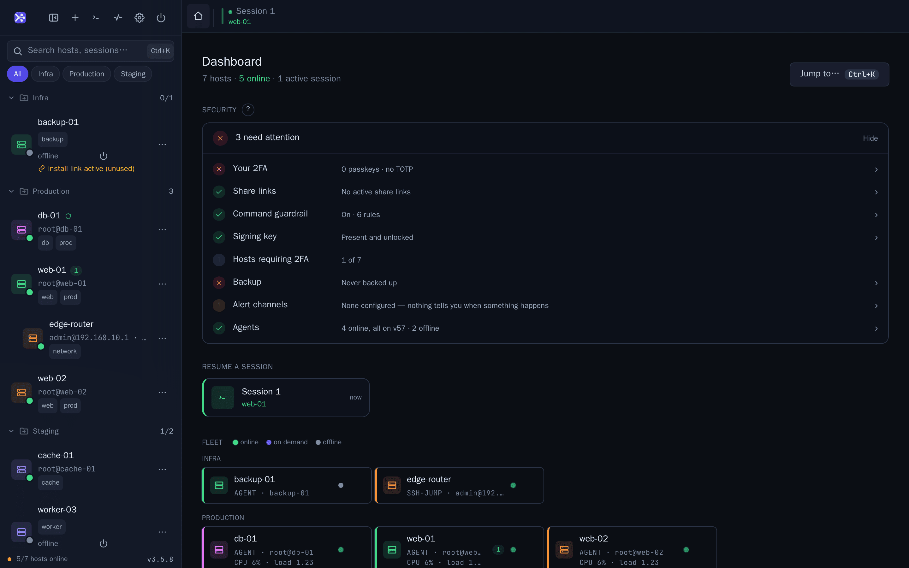
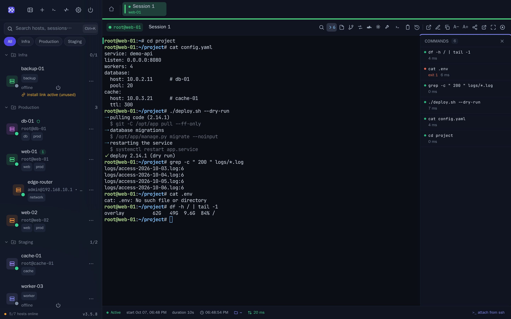
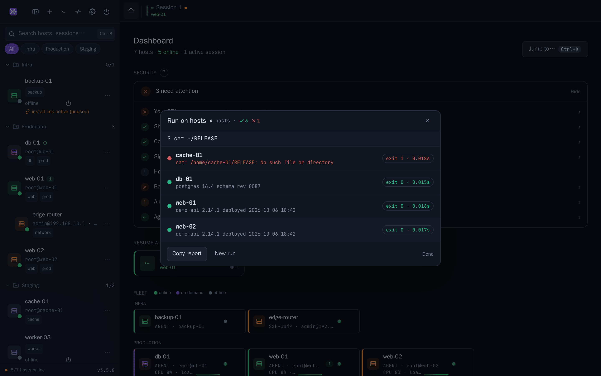
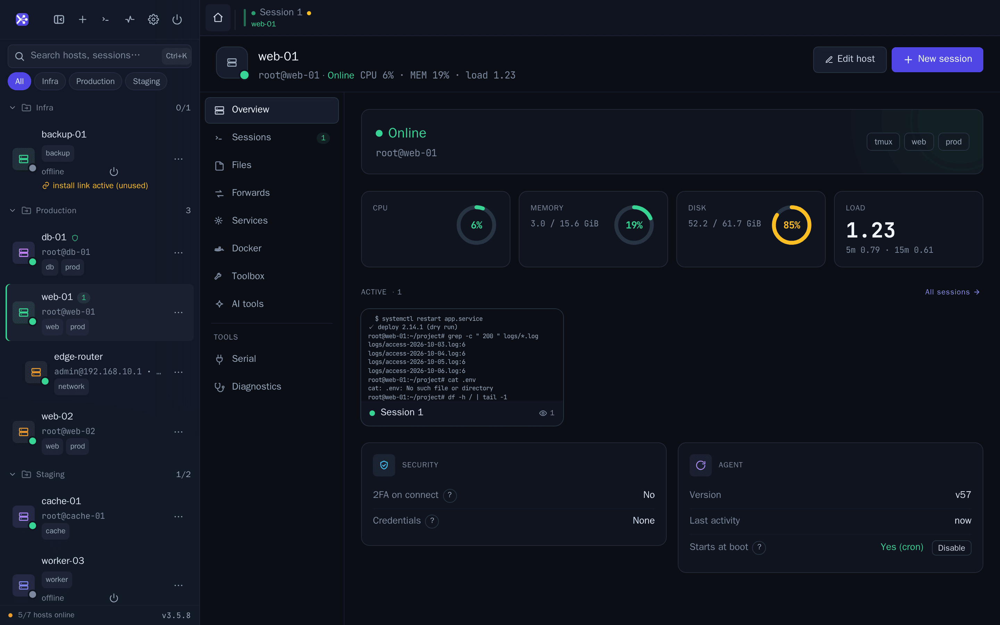
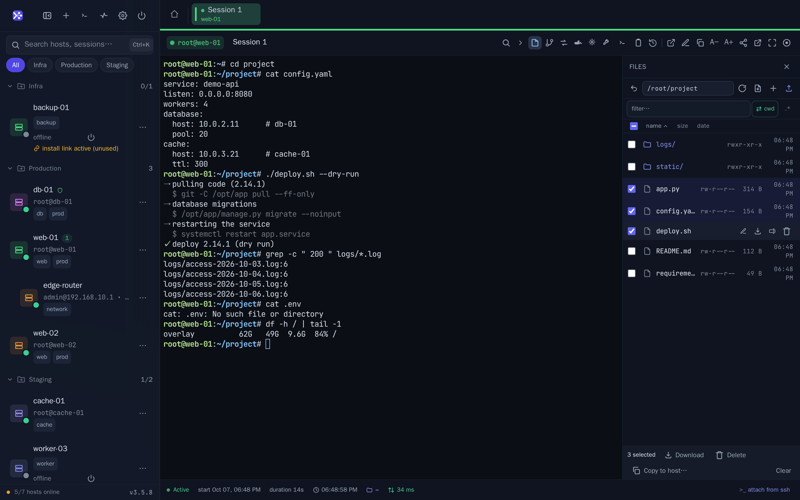
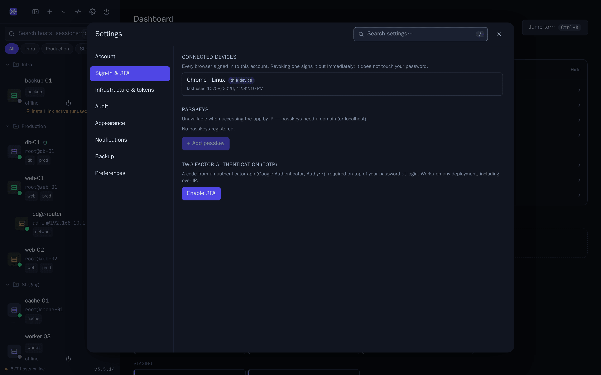
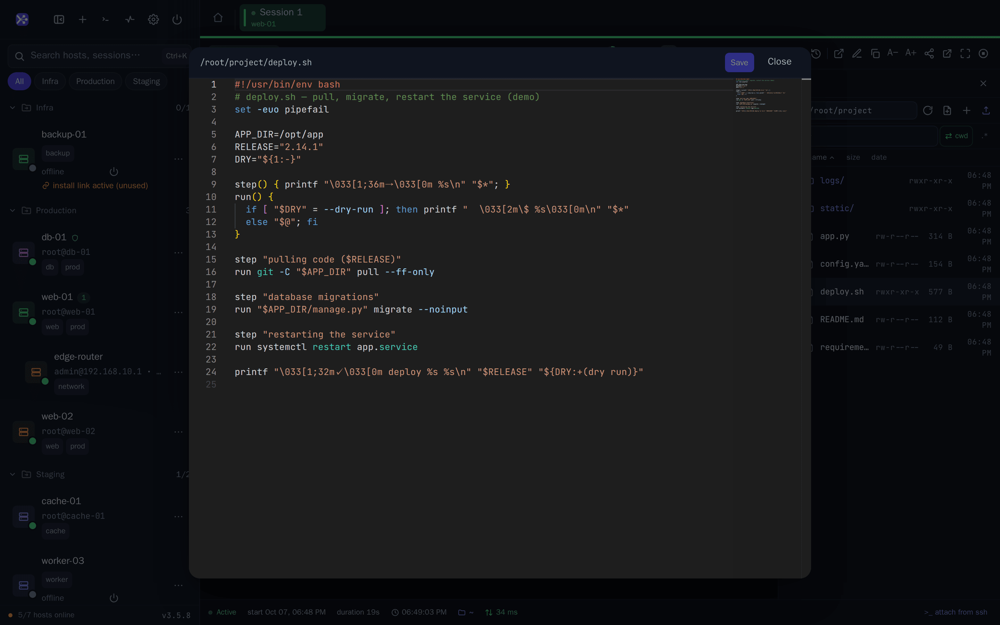
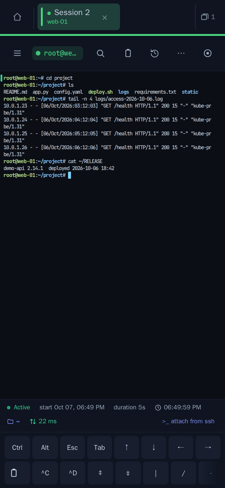

# WebTerm

[](https://github.com/sm26449/webterm/actions/workflows/docker-publish.yml)
[](LICENSE)
[](https://github.com/sm26449/webterm/tags)

**Persistent terminals for your whole infrastructure, in the browser.**

Open a shell on any of your machines from a browser — including a phone — and come back hours
later with the process still running and the scrollback intact: the session lives in tmux **on
the host**, not in the gateway. A small agent dials **out** to the gateway, so nothing listens on
your servers and a machine behind NAT works like one with a public IP; SSH and telnet cover the
gear you cannot install anything on.

<a id="what-it-is-for"></a>


```mermaid
flowchart TB
    subgraph you["You, in a browser"]
      B["Desktop · phone · tablet<br/><i>same session, several devices at once</i>"]
      SH["Share link<br/><i>read-only or writable, expires</i>"]
    end

    G["<b>Gateway</b> — one Docker container<br/><i>passkeys · 2FA · step-up on flagged hosts</i><br/><i>audit log · encrypted backups · alerts</i>"]

    subgraph reach["Three ways to reach a machine"]
      A["<b>Agent</b><br/><i>one Python file, dials OUT</i><br/><i>nothing to expose, works behind NAT</i>"]
      SSHH["<b>SSH</b><br/><i>nothing installed on the target</i>"]
      TEL["<b>Telnet</b><br/><i>switches, PDUs, old gear</i>"]
    end

    subgraph get["What you can do once you are there"]
      T["<b>Persistent sessions</b> (tmux)<br/><i>survive the browser, the gateway, the agent</i><br/><i>replay history · search · commands as objects</i>"]
      FS["<b>Files</b><br/><i>browse · edit · upload/download · git panel</i>"]
      SER["<b>Serial console</b><br/><i>RS232/RS485/USB on the host</i>"]
      FWD["<b>Port forwarding</b><br/><i>an internal web UI on its own subdomain</i>"]
      RUN["<b>Run on hosts</b><br/><i>one command → many hosts</i><br/><i>metrics · alerts · diagnostics</i>"]
    end

    B <-->|WebSocket| G
    SH -.->|watch or type| G

    G <-.->|"outbound WebSocket<br/>signed updates"| A
    G -->|dials out| SSHH
    G -->|dials out| TEL

    A --> T
    A --> FS
    A --> SER
    A --> FWD
    A --> RUN
    A -.->|"telnet bastion<br/><i>from inside the network</i>"| TEL

    SSHH --> T
    SSHH --> FWD
    TEL --> T
```

> [!WARNING]
> **Anyone who gets past the login gets, on every host, the access of the user its agent runs
> as** — like handing over an SSH key for that user. Roles (3.6) limit **which hosts** an account
> reaches and **whether it gets a shell** there, not what a shell can do; the gateway remains a
> single point of total compromise.
> Use a domain with HTTPS and passkeys, and keep the default unprivileged `webterm` agent user.
> Read [Security](#security) and [docs/THREAT-MODEL.md](docs/THREAT-MODEL.md) before exposing it.

## Screenshots

Fictional demo fleet, captured on v3.5.8 with
[`scripts/screenshots/run.sh`](scripts/screenshots/run.sh). The images follow your GitHub theme
(dark or light); the terminal itself stays dark in both.

<picture>
  <source media="(prefers-color-scheme: light)" srcset="docs/screenshots/01-dashboard-light.png">
  
</picture>

| A session with the Commands panel | Run on hosts, results per host |
|---|---|
| <picture><source media="(prefers-color-scheme: light)" srcset="docs/screenshots/02-terminal-light.png"></picture> | <picture><source media="(prefers-color-scheme: light)" srcset="docs/screenshots/07-run-on-hosts-light.png"></picture> |
| **The host page** | **Files, with multi-select** |
| <picture><source media="(prefers-color-scheme: light)" srcset="docs/screenshots/05-host-light.png"></picture> | <picture><source media="(prefers-color-scheme: light)" srcset="docs/screenshots/03-files-light.png"></picture> |
| **Settings → Sign-in & 2FA** | **The editor (Monaco)** |
| <picture><source media="(prefers-color-scheme: light)" srcset="docs/screenshots/06-security-light.png"></picture> | <picture><source media="(prefers-color-scheme: light)" srcset="docs/screenshots/04-editor-light.png"></picture> |

<p align="center"></p>

<a id="why"></a>

## Why WebTerm

- **The session outlives everything above it.** It is a tmux session on your machine: close the
  tab, restart or upgrade the gateway, kill the agent, switch to a phone — it is still there,
  re-adopted by name.
- **Nothing to expose on your servers.** The agent is one stdlib-only Python file that dials out
  over WebSocket with a token bound to that machine; the gateway stores no login for it.
- **SSH and telnet when you cannot install anything** — a switch, a customer's box — with the
  honest trade that those sessions live in the gateway and end when it restarts.
- **More than a shell:** files, an editor, Docker, systemd, database consoles, port forwards,
  one command on many hosts, pending OS updates — from the same pane, phone included.
- **Built to sit on the internet:** passkeys, 2FA step-up per host, signed agent updates, an
  audit log, encrypted backups, and a CI chain that blocks a broken image from shipping.

The long version, with the reasoning: [docs/FEATURES.md](docs/FEATURES.md#why).

<a id="quick-install"></a>
<a id="installing-verifiably"></a>
<a id="deploy-from-an-image-production-no-build"></a>
<a id="clean-server-one-command-installsh"></a>
<a id="already-have-docker-deploysh"></a>
<a id="optional-single-sign-on-with-authentik"></a>
<a id="provisioning-a-server"></a>
<a id="the-dedicated-user-cannot-sudo--decide-what-it-may-do"></a>
<a id="removing-the-agent-from-a-host"></a>

## Quick start

On a fresh **Ubuntu/Debian** server (amd64) with a domain pointing at it and ports 80/443 free:

```sh
git clone https://github.com/sm26449/webterm.git
cd webterm
git checkout v3.5.18          # the release tag from the version badge; a tag cannot move under you
less install.sh             # it is meant to be read: it runs as root
sudo ./install.sh --domain term.example.com --email you@example.com
```

The installer sets up Docker, the Traefik + WebTerm stack in `/opt/webterm`, a Let's Encrypt
certificate (HTTP-01 by default; add `--cf-token` for Cloudflare DNS-01 and a wildcard for
port-forward subdomains), the firewall and a daily encrypted backup — then prints the URL and a
**setup token**. Open the URL, create the first account with that token, and add a passkey in
**Settings → Sign-in & 2FA**.

Then **+ Add host** in the sidebar gives you a one-line install command for the agent: run it on
the server, and the host comes online. By default it creates a dedicated, unprivileged `webterm`
user and runs as that.

Other routes, all in [docs/INSTALL.md](docs/INSTALL.md):

- **Already have Docker?** `cp .env.prod.example .env`, fill it in, `./deploy.sh` —
  [details](docs/INSTALL.md#already-have-docker-deploysh).
- **Build from source, ARM, or an IP for testing:** `./setup.sh term.example.com` (or
  `./setup.sh 192.168.1.10`) — [details](docs/INSTALL.md#quick-install).
- **Single sign-on** with Authentik (bundled or your own) —
  [details](docs/INSTALL.md#optional-single-sign-on-with-authentik).
- **Putting agents on hosts:** many at once, OS support, what to grant the `webterm` user, and
  how to remove it — [details](docs/INSTALL.md#provisioning-a-server).

<a id="persistence"></a>

## Features

One line per feature; the guides have the depth, and [docs/FEATURES.md](docs/FEATURES.md) has
everything in one page.

**Terminal & sessions**
- Persistent tmux sessions with titles, notes and searchable history, open on several devices at
  once — [how persistence works](docs/FEATURES.md#persistence)
- Replay closed sessions (player or plain text) — [session lifecycle](docs/design/SESSION-LIFECYCLE.md)
- Commands as objects (OSC 133): exit code, duration and output per command, jump between them —
  [docs/SHELL-INTEGRATION.md](docs/SHELL-INTEGRATION.md)
- Named split views (2–4 sessions), broadcast typing, popout windows — [docs/design/SPLIT-VIEWS.md](docs/design/SPLIT-VIEWS.md)
- Share links, read-only or writable, expiring and revocable — [docs/FEATURES.md](docs/FEATURES.md#session-sharing)
- Keyboard-first: command palette, parametrized snippets, a full shortcut map — [docs/SHORTCUTS.md](docs/SHORTCUTS.md)
- A phone-friendly UI with a two-row key bar, installable as a PWA; English and Romanian

**Hosts & infrastructure**
- Agent, SSH, SSH-jump and telnet hosts; folders, tags, per-host 2FA and credential policies —
  [docs/HOSTS.md](docs/HOSTS.md), [docs/SSH-JUMP.md](docs/SSH-JUMP.md)
- A host page with metrics, live session previews, diagnostics, Wake-on-LAN and "starts at boot" —
  [docs/HOSTS.md](docs/HOSTS.md)
- Run on hosts: one command on many hosts with results per host; saved commands are server-side
  snippets with optional tag targets — [docs/FLEET.md](docs/FLEET.md)
- Bulk enrollment with a group token — [docs/FLEET.md](docs/FLEET.md#bulk-enrollment)
- Docker and systemd panels, pending OS updates with "upgrade in a terminal" — [docs/FEATURES.md](docs/FEATURES.md#fleet)
- Port forwarding to an internal web UI on its own subdomain, app bookmarks — [docs/PORT-FORWARDING.md](docs/PORT-FORWARDING.md)
- Telnet bastion and serial consoles through the agent — [docs/design/TELNET-BASTION.md](docs/design/TELNET-BASTION.md),
  [docs/SERIAL-CONSOLE.md](docs/SERIAL-CONSOLE.md)
- Database consoles and a command library (Toolbox), SSH deploy keys, AI-tool config —
  [docs/DATABASE-TOOLBOX.md](docs/DATABASE-TOOLBOX.md), [docs/SSH-KEYS.md](docs/SSH-KEYS.md), [docs/AI-TOOLS.md](docs/AI-TOOLS.md)

**Files & transfers**
- A Files panel that follows the terminal's `cd`, with multi-select, bulk download/delete and
  copy to another host — [docs/TRANSFERS.md](docs/TRANSFERS.md)
- Resumable uploads with an integrity check, folder downloads as `.tgz`, one Transfers widget —
  [docs/TRANSFERS.md](docs/TRANSFERS.md)
- Drop a file on the terminal, or paste a screenshot, and its path is typed at the prompt —
  [docs/TRANSFERS.md](docs/TRANSFERS.md)
- A Monaco (VS Code) editor and a Git panel — [docs/FEATURES.md](docs/FEATURES.md#fleet)

**Security**
- Passkeys, TOTP, per-host step-up and idle lock, a command guardrail — [docs/GUARDRAIL.md](docs/GUARDRAIL.md)
- A Security card on the dashboard that says what needs attention — [docs/SECURITY-SUMMARY.md](docs/SECURITY-SUMMARY.md)
- Signed agent updates with your own key, audit log, scoped automation tokens —
  [docs/SECURITY-FEATURES.md](docs/SECURITY-FEATURES.md), [docs/AUTOMATION-TOKENS.md](docs/AUTOMATION-TOKENS.md)

**Operations**
- Email and webhook alerts (security events, resource thresholds) — [docs/ALERTS.md](docs/ALERTS.md)
- Encrypted backups from the UI, scheduled, off-host to Drive/Dropbox/SFTP/FTPS — [docs/INSTALL.md](docs/INSTALL.md#backup)
- One-command upgrade with automatic rollback — [Upgrade and rollback](#upgrade-and-rollback)
- Recovery procedures, including when the UI is unreachable — [docs/RUNBOOK.md](docs/RUNBOOK.md)

## Security

Hardened for public exposure: argon2 passwords and passkeys, a single-use setup token,
brute-force lockout on the real client IP, `__Host-` cookies, Origin checks on every WebSocket,
CSP and HSTS. Hosts can require a 2FA **step-up** to connect and lock their terminals on
inactivity; a command guardrail can confirm or block dangerous commands, server-side. What you
type is never recorded — transcripts hold output only.

**Roles, honestly.** Since 3.6 every account has role bindings — Owner, Admin, Operator or Viewer
over all hosts, a folder, a tag or a single host ([docs/ROLES.md](docs/ROLES.md)). The gateway
enforces which hosts an account can see at all and whether it gets a shell there; whoever has a
shell on a host has the files of that agent's user, like SSH. Upgrading changes nothing for
existing accounts (they become Owners). That is why the defaults are a dedicated unprivileged
agent user, passkeys, and a domain with HTTPS.

Agent updates are Ed25519-signed with a key your gateway generates on first boot, so your fleet
trusts only your key. Keep an offline backup of `data/agent-signing.key`: without it, deployed
agents accept no more updates.

- Every control in detail: [docs/SECURITY-FEATURES.md](docs/SECURITY-FEATURES.md)
- What the model defends and what it does not: [docs/THREAT-MODEL.md](docs/THREAT-MODEL.md)
- Reporting a vulnerability: [SECURITY.md](SECURITY.md)

## Configuration

Everything lives in `.env` next to the compose file (`.env.prod.example` for an image deploy;
`install.sh` writes it for you). The ones you are most likely to touch:

| Variable | Role |
|---|---|
| `WEBTERM_PUBLIC_URL` | public URL used by browsers, agents and passkeys, e.g. `https://term.example.com` |
| `WEBTERM_DOMAIN` | the domain the TLS certificate is issued for |
| `LETSENCRYPT_EMAIL` | contact for Let's Encrypt (image deploy) |
| `CF_DNS_API_TOKEN` | optional Cloudflare token: DNS-01 instead of HTTP-01, and a wildcard for forwards |
| `WEBTERM_ALERT_WEBHOOK` | Slack/Discord/Teams or any JSON endpoint for alerts (also in Settings → Notifications) |
| `WEBTERM_SMTP_HOST` / `WEBTERM_ALERT_TO` | email alerts; without an SMTP host they are off |
| `WEBTERM_OIDC_ISSUER` / `_CLIENT_ID` / `_CLIENT_SECRET` | single sign-on; off until all three are set ([docs/SSO.md](docs/SSO.md)) |
| `WEBTERM_TRUSTED_PROXY_HOSTS` | the proxy allowed to set `X-Forwarded-For` (compose sets it for you) |

The full reference — every variable, secrets as `_FILE`s, agent-side and backup-script settings:
**[docs/CONFIGURATION.md](docs/CONFIGURATION.md)**.

<a id="backup"></a>

Back up the `webterm-data` volume, and above all `agent-signing.key` in it; the archive's
passphrase and `.env` are **not** in it. Backups from the UI and the scheduled timer:
[docs/INSTALL.md](docs/INSTALL.md#backup); the rebuild checklist:
[docs/RUNBOOK.md](docs/RUNBOOK.md#what-the-archive-does-not-contain).

<a id="commands-makefile"></a>

## Upgrade and rollback

```sh
cd /opt/webterm && sudo ./upgrade.sh     # latest release; or pass a tag: sudo ./upgrade.sh v3.5.18
./rollback.sh                           # back to the previous image, any time afterwards
```

`upgrade.sh` takes a backup, pulls the image and pins it **by digest**, syncs the scripts that run
on the host, and hands off to `deploy.sh`, which rolls back by itself if the new container does
not become healthy. With `cosign` installed and `WEBTERM_COSIGN_IDENTITY` set, it verifies the
image signature first. WebTerm never updates itself; the UI only tells you a release exists.
Details: [docs/INSTALL.md](docs/INSTALL.md#upgrading); when things go wrong:
[docs/RUNBOOK.md](docs/RUNBOOK.md).

<a id="development"></a>
<a id="tests"></a>
<a id="layout"></a>
<a id="testing--release-gates"></a>

## Contributing and tests

```sh
make test         # the hermetic suite — exactly what CI gates the image on
make test-local   # + the suites that need a real tmux/agent (sandboxed from production)
```

Before an image is published, CI runs the unit suite, ruff, gitleaks and `pip-audit`, verifies
the agent signature, boots the image, and drives it in a browser: an E2E run with a **real agent
on tmux** (`scripts/e2e-session.mjs`, 187 checks), file and port-forward tests, a mobile audit on
10 devices and an accessibility gate. Building from source, the test layout and the full chain:
[docs/DEVELOPMENT.md](docs/DEVELOPMENT.md). How to contribute — including re-signing the agent
and regenerating these screenshots — is in [CONTRIBUTING.md](CONTRIBUTING.md).

## License

[MIT](LICENSE) · history in the [CHANGELOG](CHANGELOG.md).

<a id="acknowledgments"></a>
Built by Stefan Maldaianu, with development assistance from Claude (Anthropic).
