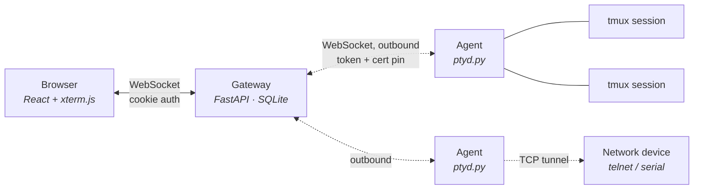

# Architecture

WebTerm has three moving parts. Understanding how they divide responsibility explains most of
the design decisions in this directory.

## The gateway

One container: FastAPI, SQLite, and the built frontend. It holds the accounts, the session
metadata, the transcripts, and the credential vault. It never listens on your hosts. For agent hosts it never
initiates a connection either — the agent dials out. Hosts of type `ssh` and `telnet` are the
exception, and there the gateway does connect outward to them.

State that must survive a restart lives in SQLite or on disk. State that must not — step-up
windows, lockout counters, WebAuthn challenges — lives in memory, which is why a single replica
is assumed. A restart therefore clears them: step-up windows close, lockout counters reset, and
in-flight WebAuthn ceremonies must be restarted.

## The agent

A single Python file with no dependencies beyond the standard library, running as an ordinary
user on each host. It **dials out** to the gateway over WebSocket; nothing needs to be exposed on
the host, and a host behind NAT or a mobile connection works the same as one with a public IP.

Two properties follow from that shape:

- **The host is never a listening surface.** There is no port to firewall, no key to distribute,
  no inbound rule to get wrong.
- **The agent is replaceable but not silently.** Updates are Ed25519-signed and verified against a
  public key baked into the running agent. See [SIGNED-UPDATES.md](SIGNED-UPDATES.md).

## tmux, and why sessions survive

The agent does not own your shell — tmux does. A session is a tmux session on the host; the agent
attaches to it and pipes bytes. That is what makes a session survive the agent restarting, the
gateway restarting, your laptop closing, and the network dropping.

It also means the screen is **not** the source of truth. tmux delivers out-of-band data (OSC 133
shell markers, for instance) through DCS passthrough, so anything that needs to read structured
output reads the byte stream, not the rendered screen. Code that forgets this works in testing
and fails under tmux. See [SESSION-LIFECYCLE.md](SESSION-LIFECYCLE.md).

## Trust boundaries

| Boundary | What crosses it | What protects it |
|---|---|---|
| Browser → gateway | session cookie, typed input | `__Host-` cookie, Origin check on every WebSocket, step-up for 2FA hosts |
| Gateway → agent | commands, signed agent updates | per-host token; in `insecure` mode (self-signed / IP) the agent pins the certificate and checks it **before** sending the token. With a public CA the pin is not used — ordinary TLS validation covers it |
| Agent → host | process execution | the agent's own user; it never escalates |
| Gateway → forwarded service | proxied HTTP/WS | signed forward token, target read from the database, never from the URL |

The gateway is the most valuable thing in the system: whoever controls it controls every host
running an agent. There is no privilege separation inside it — see `docs/THREAT-MODEL.md` for the
full statement of what that does and does not mean.

## Why there is no RBAC

Accounts exist, but they are all equal. Adding roles would mean deciding what a "read-only" user
may do with a terminal that can `cat` a private key, and the honest answer is: nothing useful.
Multi-tenant separation would have to happen below WebTerm, at the host level. That direction is
sketched in [FUTURE-DIRECTIONS.md](FUTURE-DIRECTIONS.md) and deliberately not built.
